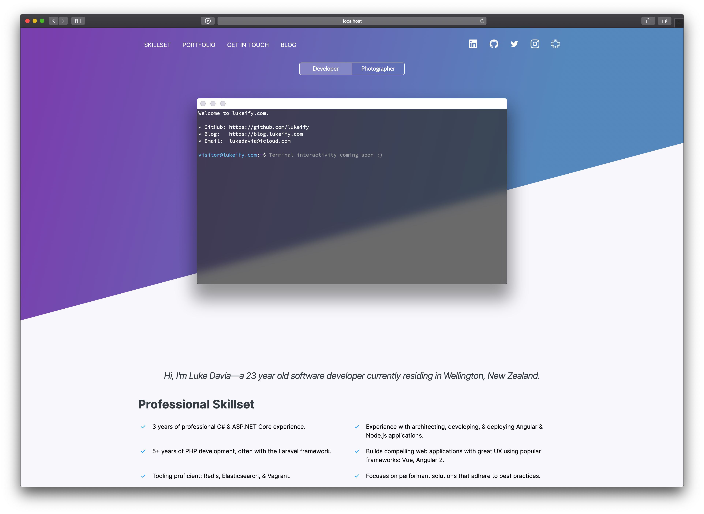

# lukeify

[](https://github.com/lukeify/lukeify)
[](https://github.com/lukeify/lukeify/blob/master/LICENSE)


[](https://lukeify.com)




Personal website including portfolio & skillset.

## User Instructions

To view, go to https://lukeify.com

## Getting started

Contained below are instructions on how to run this project for those who would like to fork this repository to build their own portfolio.

### Prerequisites

Ensure you have Yarn, the [Angular CLI](https://cli.angular.io), as well as a remote server with the ability to start a node.js script. 

Additionally, please create a `config.json` file based off of the `config.example.json` sample provided and place it in `./server`.

### Installation

```
yarn install angular-cli -g
git clone https://github.com/lukeify/lukeify.git
cd lukeify
cd node && yarn install
cd ../angular && yarn install
```

### Building

Several scripts are provided for execution for ease of development:

* `client:start`: Runs an Angular Hot Module Reloading environment at localhost:4200.
* `client:build`: Compiles the frontend using ahead of time compilation and minification to be served by our backend.
* `server:build:watch`: Watches for changes and compiles the typescript node server.
* `server:build`: Compiles the typescript node server.
* `server:run:dev`: Runs the server in a development environment.
* `server:run:prod`: Runs the server in a production environment.
* `server:run:cron`: To be executed via cron at a user's desired frequency to gather tweets & instagram photos from their profile and store them locally to be served.

## Deployment

Push to GitHub, then from remote repository:

```
git clone https://github.com/lukeify/lukeify.git
yarn install
yarn run client:build
yarn run server:build
```

Now ensure you have `./server/config.json` configured properly. Follow the exemplar configuration. Then, run `yarn run server:run:prod` using your favorite keep-alive tool, such as forever.js. To run the Twitter & Instagram updating functionality, schedule a cron to call `yarn run server:run:cron` at a frequency of your choosing. 

## Built With

* Node.js (Runtime Environment)
* Express.js (Web Framework)
* Yarn (Package Manager)
* Angular (Frontend Framework)
* Sass (Styling)

## Versioning

This site adheres to [semantic versioning](https://semver.org).

## Author

Luke Davia.

## License

The design of this repository is licensed under the [MIT License](LICENSE). The name *lukeify*, and any content posted on this website are property of the author. For more on this license, [read the summary on tldrlegal.com](https://tldrlegal.com/license/mit-license).
